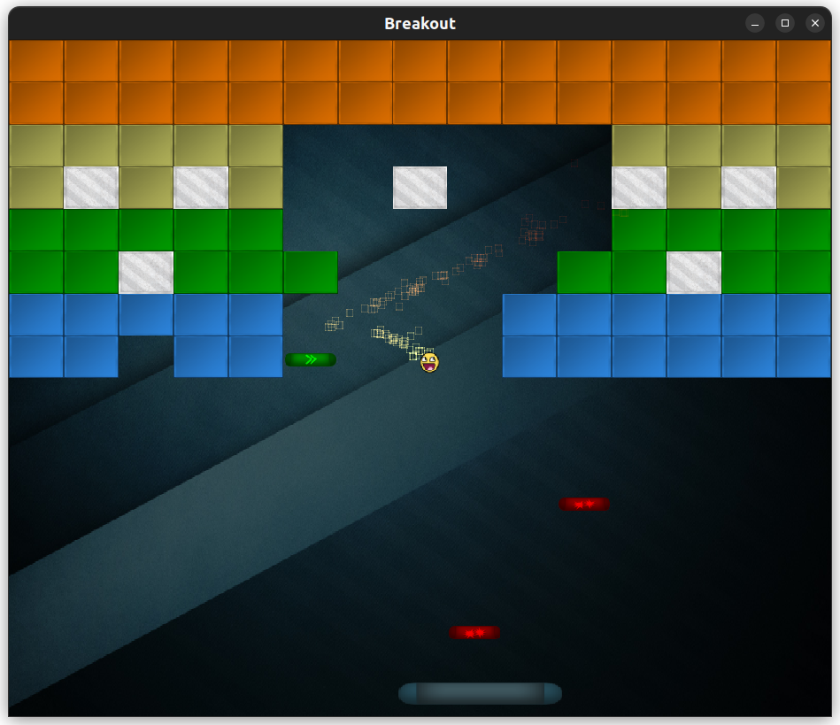

# Breakout

This repo contains 2 versions of a breakout clone running on a custom OpenGL lib/engine done with assets and guidance from [learnopengl.com](https://learnopengl.com/In-Practice/2D-Game/Breakout). Both of them served as testbed projects for various features of OpenGL and other 3rd-party libraries (more below). They were initially a part of a different repo containing the rendering engine itself, but were split and moved here to keep the engine repo clean. Expect to see some bizzare things in the git commit history because of that.

None of the games are actually intended to be played, you can't even loose the game. Not that you'd need more loss in life, tbh. This is a postmortem mostly and I don't intend to touch this code ever again. I've learned what I wanted.




# First version of breakout

The first version in `src/breakout/` was used to learn about practical application of framebuffers, postprocessing and just making something interactive work in real-time (like a game, yeah). It is more feature complete, with a particle system and fully functioning pickups and their effects. The code itself and it's basic architectural qualities are abysmal, however. Everything wants to be a "GameObject" but actually isn't even that, but rather just copy pastes what's needed. For a game of this scale, though, this is alright. I don't like GameObjects anyways.


# Second version of breakout

The second version found in `src/breakout2` was made to get some practice on ECS and event-driven logic, and to use box2d for the physics engine. Now, to be honest, architecturally this is a much cleaner version. ECS is just a blessing for scenarios like these. Events also help decouple logical sources from actions quite a bit with a simple "multiple senders" (systems) - "single reciever" (game) approach. All without any virtual mumbo-jumbo; just by sending enums and some data. Box2D was... eh, not the greatest choice for a game like this. Quality dynamics simulations are not what you need when your ball has to be predictable in it's movement and the paddle has to violate the laws of physics to feel responsive.

Regardless, gaining some basic appreciation of ECS was especially helpful, and EnTT later became the core component (get it?) of the rendering engine itself.


# Requirements and Dependencies

Requires: C++20, CMake 3.20, vcpkg.

The engine snapshot that this project depends on will be pulled via FetchContent and cmake magic. Everything else via vcpkg.


# Configure, Build and Run

```
VCPKG_ROOT=[path-to-vcpkg]
mkdir build
cmake -S . -B build
cmake --build build
```

Run executables from the project root.
